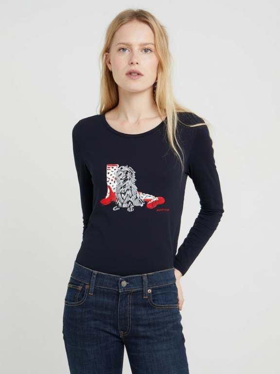
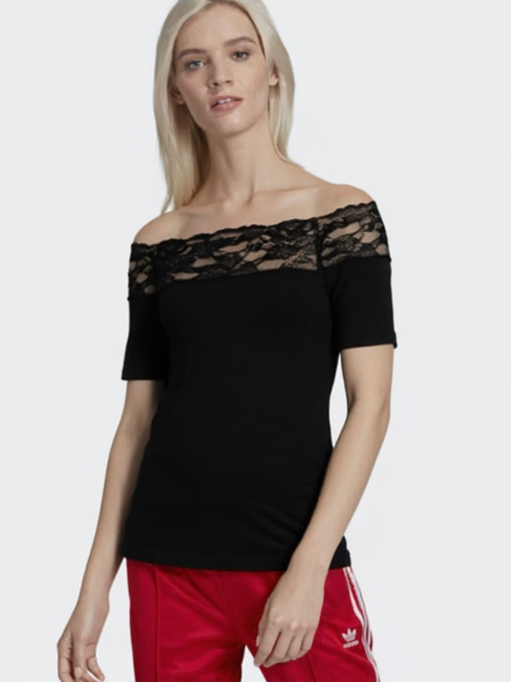
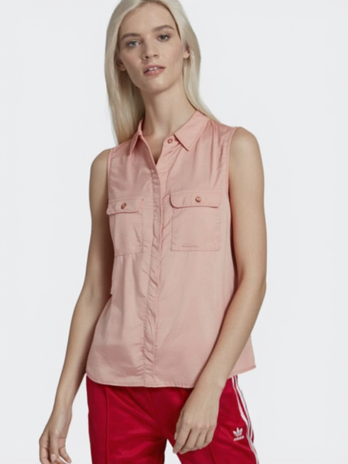

# catvton-flux

An state-of-the-art virtual try-on solution that combines the power of [CATVTON](https://arxiv.org/abs/2407.15886) (Contrastive Appearance and Topology Virtual Try-On) with Flux fill inpainting model for realistic and accurate clothing transfer.
Also inspired by [In-Context LoRA](https://arxiv.org/abs/2410.23775) for prompt engineering.

## Update
[](https://drive.google.com/file/d/1T2W5R1xH_uszGVD8p6UUAtWyx43rxGmI/view?usp=sharing)
[](https://github.com/shadow2496/VITON-HD)

---
**Latest Achievement** (2024/11/24):
- Released FID score and gradio demo
- CatVton-Flux-Alpha achieved **SOTA** performance with FID: `5.593255043029785` on VITON-HD dataset. Test configuration: scale 30, step 30. My VITON-HD test inferencing results available [here](https://drive.google.com/file/d/1T2W5R1xH_uszGVD8p6UUAtWyx43rxGmI/view?usp=sharing)

---

## Showcase
| Original | Garment | Result |
|----------|---------|---------|
|  |  |  |
|  |  |  |
|  |  |  |

## Model Weights
Hugging Face: 🤗 [catvton-flux-alpha](https://huggingface.co/xiaozaa/catvton-flux-alpha)

The model weights are trained on the [VITON-HD](https://github.com/shadow2496/VITON-HD) dataset.

## Prerequisites
Make sure you are runing the code with VRAM >= 40GB. (I run all my experiments on a 80GB GPU, lower VRAM will cause OOM error. Will support lower VRAM in the future.)

```bash
bash
conda create -n flux python=3.10
conda activate flux
pip install -r requirements.txt
huggingface-cli login
```

## Usage

Run the following command to try on an image:
```bash
python tryon_inference.py \
--image ./example/person/00008_00.jpg \
--mask ./example/person/00008_00_mask.png \
--garment ./example/garment/00034_00.jpg \
--seed 42 \
--output_tryon test.png \
--steps 30
```

Run the following command to start a gradio demo:
```bash
python app.py
```
Gradio demo:

<!-- Option 2: Using a thumbnail linked to the video -->
[](https://github.com/user-attachments/assets/e1e69dbf-f8a8-4f34-a84a-e7be5b3d0aec)


## TODO:
- [x] Release the FID score
- [x] Add gradio demo
- [ ] Release updated weights with better performance
- [ ] Train a smaller model

## Citation

```bibtex
@misc{chong2024catvtonconcatenationneedvirtual,
 title={CatVTON: Concatenation Is All You Need for Virtual Try-On with Diffusion Models}, 
 author={Zheng Chong and Xiao Dong and Haoxiang Li and Shiyue Zhang and Wenqing Zhang and Xujie Zhang and Hanqing Zhao and Xiaodan Liang},
 year={2024},
 eprint={2407.15886},
 archivePrefix={arXiv},
 primaryClass={cs.CV},
 url={https://arxiv.org/abs/2407.15886}, 
}
@article{lhhuang2024iclora,
  title={In-Context LoRA for Diffusion Transformers},
  author={Huang, Lianghua and Wang, Wei and Wu, Zhi-Fan and Shi, Yupeng and Dou, Huanzhang and Liang, Chen and Feng, Yutong and Liu, Yu and Zhou, Jingren},
  journal={arXiv preprint arxiv:2410.23775},
  year={2024}
}
```

Thanks to [Jim](https://github.com/nom) for insisting on spatial concatenation.
Thanks to [dingkang](https://github.com/dingkwang) [MoonBlvd](https://github.com/MoonBlvd) [Stevada](https://github.com/Stevada) for the helpful discussions.

## License
- The code is licensed under the MIT License.
- The model weights have the same license as Flux.1 Fill and VITON-HD.
